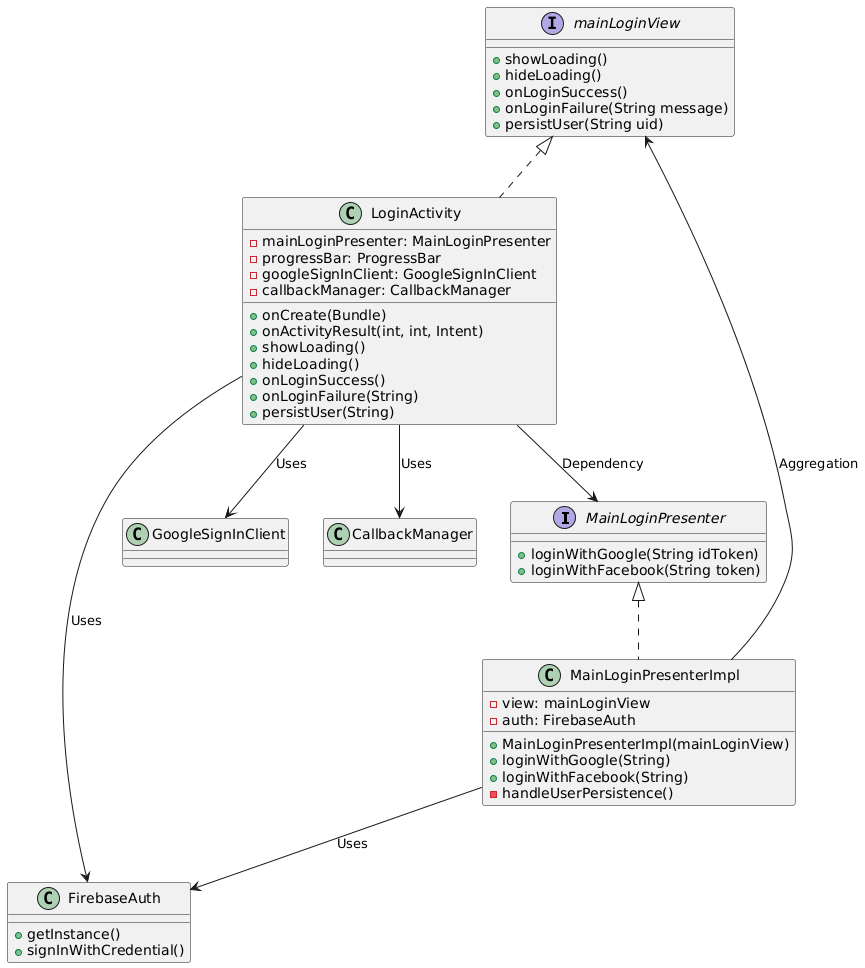
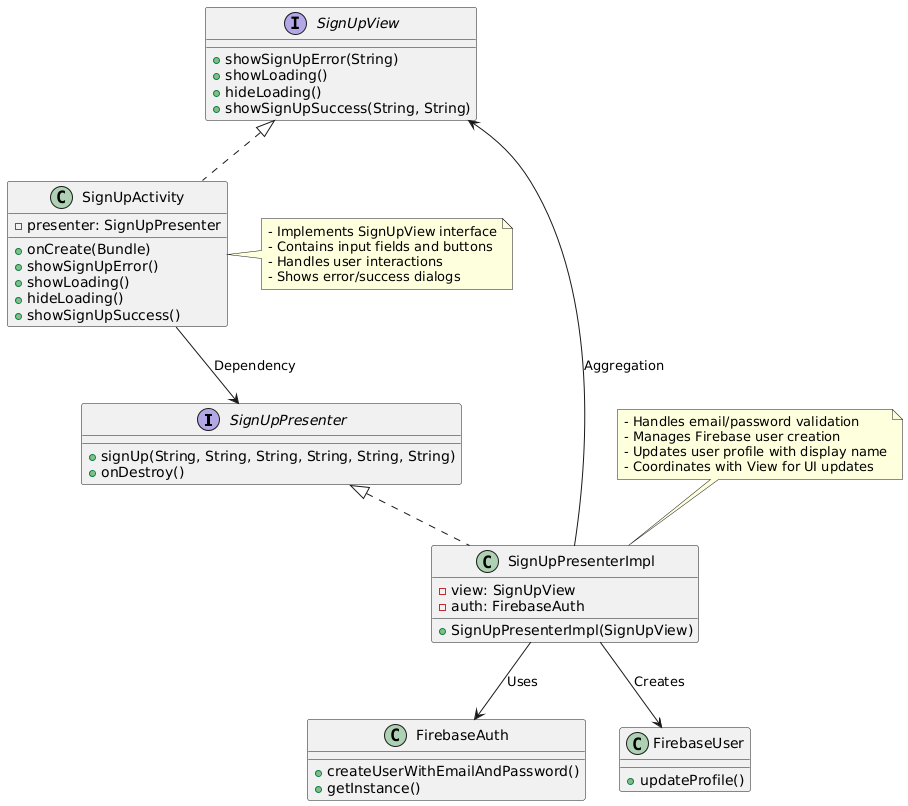
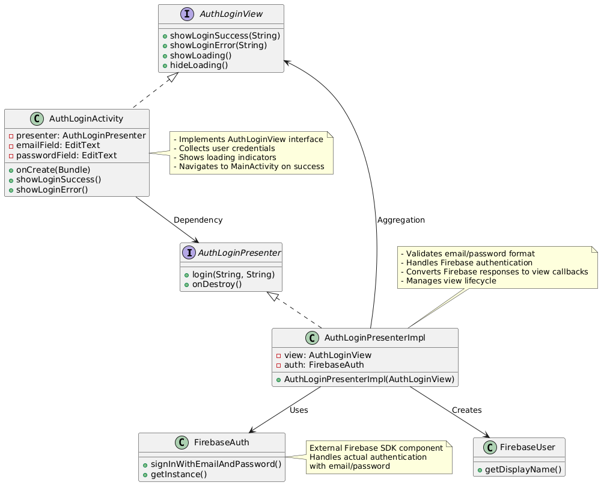
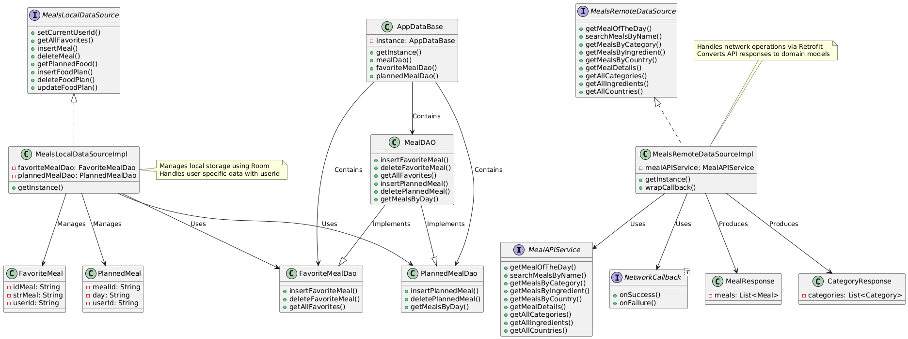
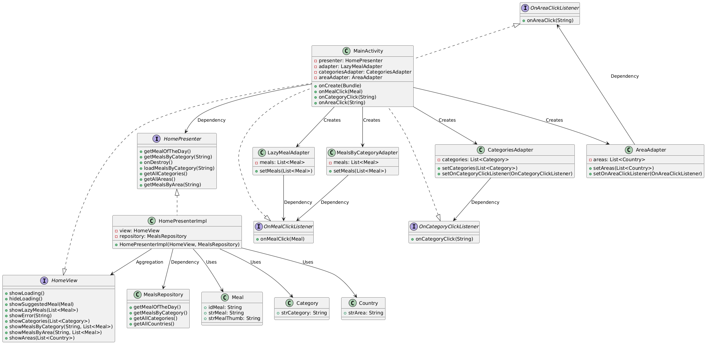
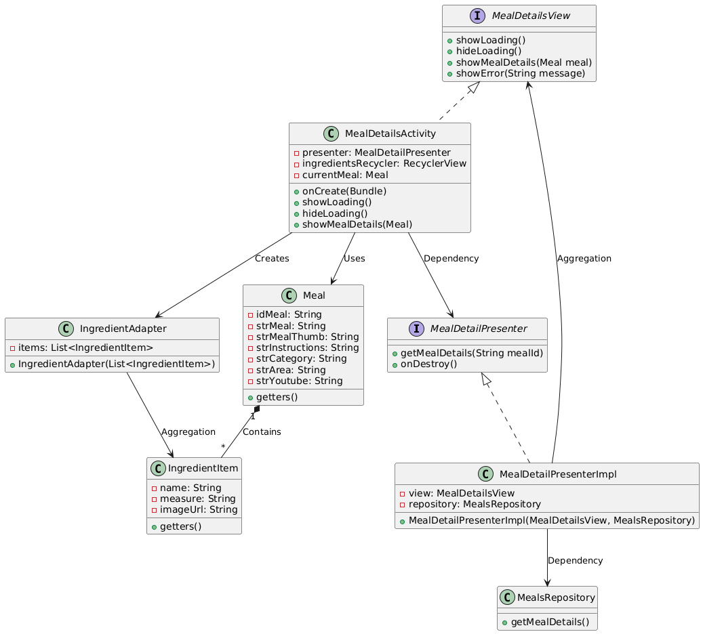
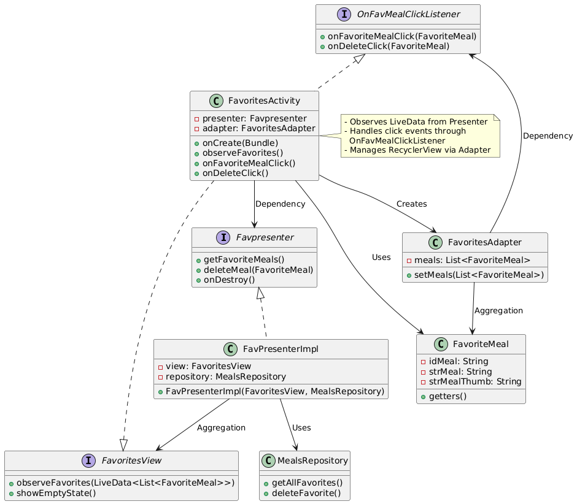
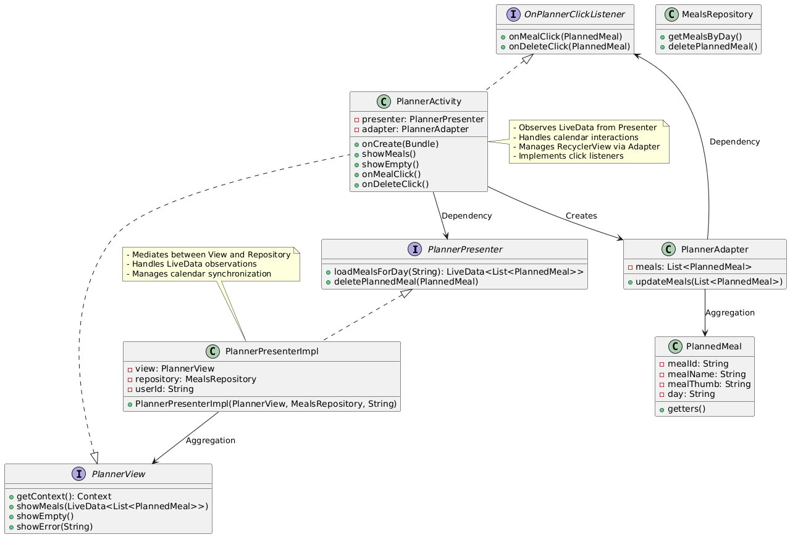
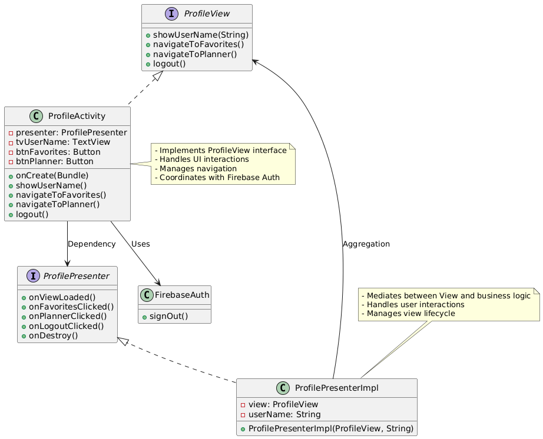
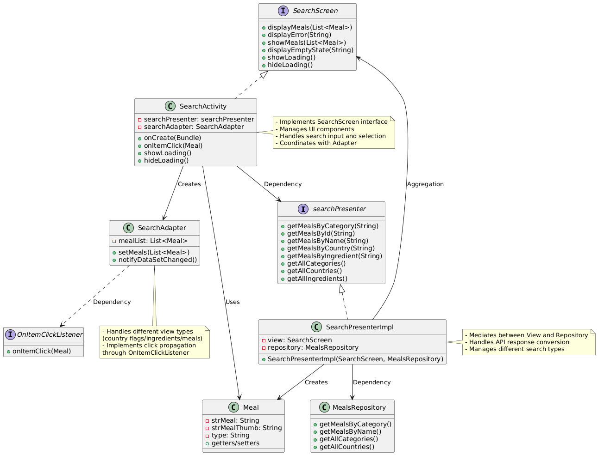

#  Food Planner Android App

A smart and user-centric mobile application to plan, organize, and explore meals using a modern Android tech stack. The app supports searching meals by category, area, or ingredient, saving favorites and meal planning, with user-specific data handling for personalized experience.

---

## Architecture

This app uses the **Model-View-Presenter (MVP)** architecture, cleanly separating business logic, UI logic, and data handling.

```plaintext
View (Activity/Fragment) <--> Presenter <--> Repository <--> Data Sources (Remote / Local)
```

###  Layered Structure

- **View** – Displays data and delegates user actions.
- **Presenter** – Handles business logic and coordinates View <-> Repository communication.
- **Repository** – Abstracts data source access, decides whether to fetch from network or database.
- **Remote Data Source** – Fetches data from TheMealDB API.
- **Local Data Source** – Persists data locally using Room (Favorites, Planned Meals).
- **Models** – POJOs (e.g. Meal, Category, Country).

---

##  Features

| Feature              | Description                                                                 |
|----------------------|-----------------------------------------------------------------------------|
| Search               | Search meals by name, ingredient, category, or area.                        |
| Favorites            | Mark meals as favorites; favorites are stored per user.                     |
| Meal Planner         | Plan meals for days in the current week only.                               |
| Meal of the Day      | Displays a randomly fetched meal.                                           |
| Filter by Area       | Show meals based on selected country or area.                               |
| Filter by Category   | Show meals based on selected category.                                      |
| User Authentication  | Google / Facebook / Guest login.                                            |
| MVP Architecture     | Clean separation of concerns and testability.                               |
| User-specific data   | All planned and favorite meals are scoped to the authenticated user.       |

---

##  Tech Stack

| Technology         | Purpose                                  |
|--------------------|-------------------------------------------|
| Kotlin / Java      | Android development                       |
| MVP                | Presentation architecture pattern         |
| Retrofit2          | API Communication                         |
| Room               | Local database (Favorites, Planner)       |
| LiveData           | Observable UI updates                     |
| Firebase Auth      | Login (Email, Google, Facebook)           |
| Glide              | Image loading                             |
| ConstraintLayout   | Modern responsive UI                      |
| SharedPreferences  | Persist user identity                     |

---
## UMLs (Relation between Different classes)











---
##  Sequence Diagram – Favorites

```plaintext
User taps Favorite icon
        |
        v
Presenter.addToFavorites(meal)
        |
        v
Repository.insertFavorite(meal)
        |
        v
LocalDataSource.insertMeal(meal) ---> Room Database (with userId)
```

---

## Sequence Diagram – Meal Planning

```plaintext
User selects day from calendar
        |
        v
Presenter.loadMealsForDay(day)
        |
        v
Repository.getMealsByDay(userId, day)
        |
        v
Room Query WHERE day = :day AND userId = :userId
        |
        v
LiveData<List<PlannedMeal>> -> View
```

---
## User-Specific Data

- **SharedPreferences** stores the currently authenticated user's Firebase UID:
  
```java
SharedPreferences prefs = getSharedPreferences("FoodAppPrefs", MODE_PRIVATE);
prefs.edit().putString("USER_UID", uid).apply();
```

- **FavoriteMeal & PlannedMeal models** include a `userId` field for scoping.

- **Room DAO queries** are filtered by `userId`:
  
```sql
SELECT * FROM favorite_meals WHERE userId = :userId
```

---

## Folder Structure

```plaintext
com.example.foodplanner/
│
├── db/
│   ├── local/         # Room, DAOs, Entities
│  
 ── network/
│   ├── remote/        # Retrofit, APIs
│   
├── ui/
│   ├── home/
│   ├── favorites/
│   ├── planner/
│   ├── profile/
│   └── search/
│
├── models/
     └── repository/    # MealsRepository
     └── POJOs/
├── utils/

```

---

## Testing & Debugging Tips

- Use **`adb shell pm clear com.example.foodplanner`** to simulate fresh install.
- Ensure **Firebase UID** is saved in `SharedPreferences` after login.
- Watch `Logcat` for Room/Retrofit logs using custom tags.

---

## TODOs & Enhancements

- [ ] Add offline caching for meals.
- [ ] Add weekly meal export/share.
- [ ] Allow calorie tracking for planned meals.
- [ ] Add onboarding screen.

---


